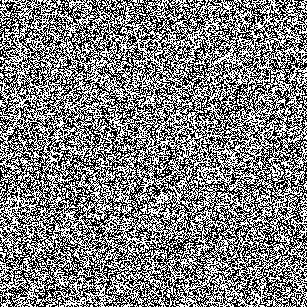

# math-random-patterns
Are there patterns in `math.random`? Inspired by [Hardware Random Number Generators](http://ubld.it/products/truerng-hardware-random-number-generator/)



# usage
```javascript
/*
main [function]
args:
size of canvas square [number]
size of dot [number]
*/
main(500, 1);
```

# demo
[demo](http://codepen.io/KarlPokus/pen/OWbpgy?editors=0010)

# licence
MIT
